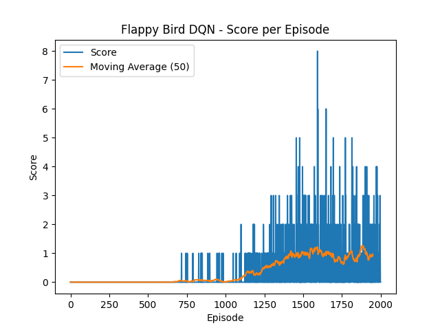
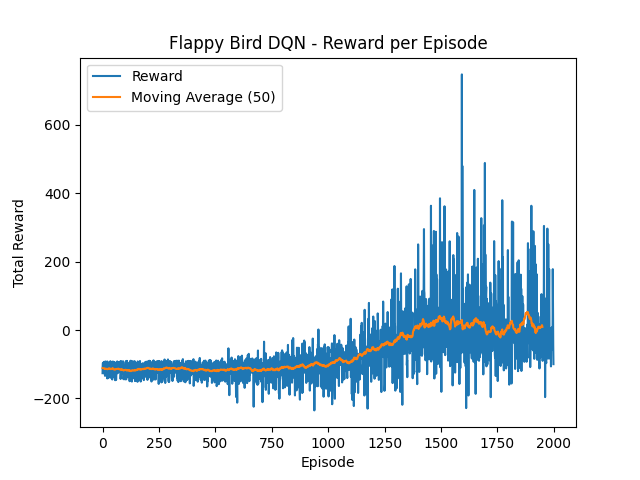

# Flappy Bird with Deep Reinforcement Learning

A Deep Reinforcement Learning project that trains an agent to play **Flappy Bird** using a Deep Q-Network (DQN) implemented with **PyTorch**.

The project includes a custom game environment, experience replay, a target network, ε-greedy exploration, reward shaping, hyperparameter tuning through grid search, and a 2,000-episode training run.

---

## Overview

The goal is to train an agent that learns when to flap or do nothing in order to avoid obstacles and maximize its cumulative reward and game score.

The project follows the workflow:

```text
Environment
    ↓
DQN Agent
    ↓
Experience Replay
    ↓
Hyperparameter Grid Search
    ↓
Best Configuration
    ↓
Final Training
    ↓
Training Curves
```

The environment is implemented specifically for this project rather than using an external game or a pre-built reinforcement learning environment.

---

## State and Action Space

The agent receives a **4-dimensional state vector** at every timestep:

| State Variable | Description |
|---|---|
| `bird_y` | Bird's vertical position |
| `bird_velocity` | Bird's vertical velocity |
| `pipe_x` | Horizontal position of the next pipe |
| `bird_y - pipe_gap_y` | Vertical distance between the bird and the center of the pipe gap |

The state is normalized before being passed to the neural network.

### Actions

The action space contains two discrete actions:

| Action | Description |
|---|---|
| `0` | Do nothing |
| `1` | Flap |

---

## DQN Architecture

The Q-network is a fully connected neural network (MLP):

```text
Input (4)
   │
   ▼
Linear(4 → 64)
   │
  ReLU
   │
   ▼
Linear(64 → 64)
   │
  ReLU
   │
   ▼
Linear(64 → 2)
```

The two output values represent the estimated Q-value for each available action.

The agent uses two networks:

- **Online network** — updated during training
- **Target network** — periodically synchronized with the online network

---

## Reinforcement Learning Components

### Experience Replay

Transitions are stored in a replay buffer:

```text
(state, action, reward, next_state, done)
```

During training, random mini-batches are sampled from the buffer instead of training only on consecutive experiences.

This helps reduce correlations between consecutive observations and improves training stability.

### Target Network

A separate target network is used when calculating the temporal-difference target.

The target network is periodically synchronized with the online network during training.

### ε-Greedy Exploration

The agent uses ε-greedy action selection:

- High ε → more exploration
- Low ε → more exploitation

The implemented agent starts with:

```text
epsilon = 1.0
```

and gradually decays it toward a minimum value of:

```text
epsilon_min = 0.05
```

### Target Action Selection

For the next state, the online network selects the action with the highest estimated Q-value, while the target network evaluates that action.

This separates action selection from action evaluation and follows the Double-DQN-style target calculation used in the implementation.

### Loss Function

Training uses **Smooth L1 (Huber) loss**.

Gradient clipping is also applied with a maximum gradient norm of `1.0`.

---

## Reward Design

The environment uses reward shaping to provide the agent with both immediate and intermediate feedback.

| Event | Reward |
|---|---:|
| Surviving a timestep | `+1` |
| Passing a pipe | `+10` |
| Collision / death | `-100` |
| Flapping | `-0.1` |
| Distance from pipe gap | Small negative penalty |

The distance penalty is controlled by:

```python
distance_weight
```

This encourages the agent to remain closer to the center of the pipe gap instead of only reacting to imminent collisions.

---

## Hyperparameter Tuning

A grid search was used to investigate the effect of several hyperparameters.

The search space contains:

```python
param_grid = {
    "lr": [1e-3, 5e-4],
    "epsilon_decay": [0.995, 0.998],
    "gamma": [0.99, 0.95],
    "distance_weight": [0.01, 0.02]
}
```

This results in:

```text
2 × 2 × 2 × 2 = 16 configurations
```

Each configuration was trained for **500 episodes**.

Configurations were compared using the **average score over the final 50 episodes**.

### Best Configuration

The configuration selected from the grid search was:

```python
BEST_CONFIG = {
    "lr": 5e-4,
    "epsilon_decay": 0.998,
    "gamma": 0.95,
    "distance_weight": 0.01
}
```

The corresponding average score over the final 50 episodes was:

```text
1.30
```

---

## Final Training

The selected configuration was then used for a longer training run of:

```text
2,000 episodes
```

The training process records:

- Episode scores
- Episode rewards
- Moving averages
- Training loss

The training script also saves the trained models:

```text
best_flappy_model.pth
final_flappy_model.pth
```

---

## Results

The repository contains the learning curves produced during training.

### Training Score



### Training Reward



The results show the learning behaviour of the agent throughout the training process. Performance is not perfectly stable, highlighting the sensitivity of this relatively small DQN setup to exploration, reward shaping, and training duration.

The project is therefore primarily focused on implementing and evaluating a complete Deep Reinforcement Learning pipeline rather than achieving a high game score.

---

## Project Structure

```text
Flappy-Bird-DQN/
│
├── assets/
│   └── bird.png
│
├── results/
│   ├── training_scores.png
│   └── training_rewards.png
│
├── src/
│   ├── agent.py
│   ├── dqn.py
│   ├── flappy_bird.py
│   ├── grid_search.py
│   ├── main.py
│   ├── replay_buffer.py
│   └── train.py
│
├── .gitignore
├── README.md
└── requirements.txt
```

### Main Components

| File | Purpose |
|---|---|
| `flappy_bird.py` | Custom Flappy Bird environment and reward logic |
| `dqn.py` | Neural network architecture |
| `agent.py` | DQN agent and training logic |
| `replay_buffer.py` | Experience replay implementation |
| `grid_search.py` | Hyperparameter search |
| `train.py` | Final training pipeline |
| `main.py` | Manual interaction / environment demo |

---

## Running the Project

### 1. Install Dependencies

```bash
pip install -r requirements.txt
```

### 2. Run the Environment

To manually test the Flappy Bird environment:

```bash
python src/main.py
```

Use:

```text
SPACE → Flap
```

### 3. Run Hyperparameter Search

To reproduce the grid search:

```bash
python src/grid_search.py
```

### 4. Train the Agent

To run the final training configuration:

```bash
python src/train.py
```

The training script produces the model checkpoints and learning curves described above.

---

## Limitations

The current implementation has several limitations:

- The agent uses a relatively small MLP rather than raw image observations.
- Training performance is sensitive to reward shaping and hyperparameter selection.
- The final score remains relatively low and is not consistently stable.
- The experiments are based on a limited number of training runs and configurations.
- The current environment provides engineered state features rather than visual input.

These limitations leave room for further experimentation.

---

## Future Work

Possible extensions include:

- More extensive hyperparameter tuning
- Training with multiple random seeds
- Dueling DQN architecture
- Prioritized Experience Replay
- Explicit evaluation of a full Double DQN implementation
- CNN-based image observations
- Further experimentation with reward shaping
- Longer training runs

---

## Technologies

- **Python**
- **PyTorch**
- **NumPy**
- **Pygame**
- **Matplotlib**

---

## Key Concepts Demonstrated

- Deep Q-Learning
- Experience Replay
- Target Networks
- ε-Greedy Exploration
- Reward Shaping
- Q-Value Estimation
- Huber Loss
- Gradient Clipping
- Hyperparameter Grid Search
- Reinforcement Learning Training and Evaluation

---

## Author

**Andreas Darsaklis**

Computer Science  
Aristotle University of Thessaloniki
